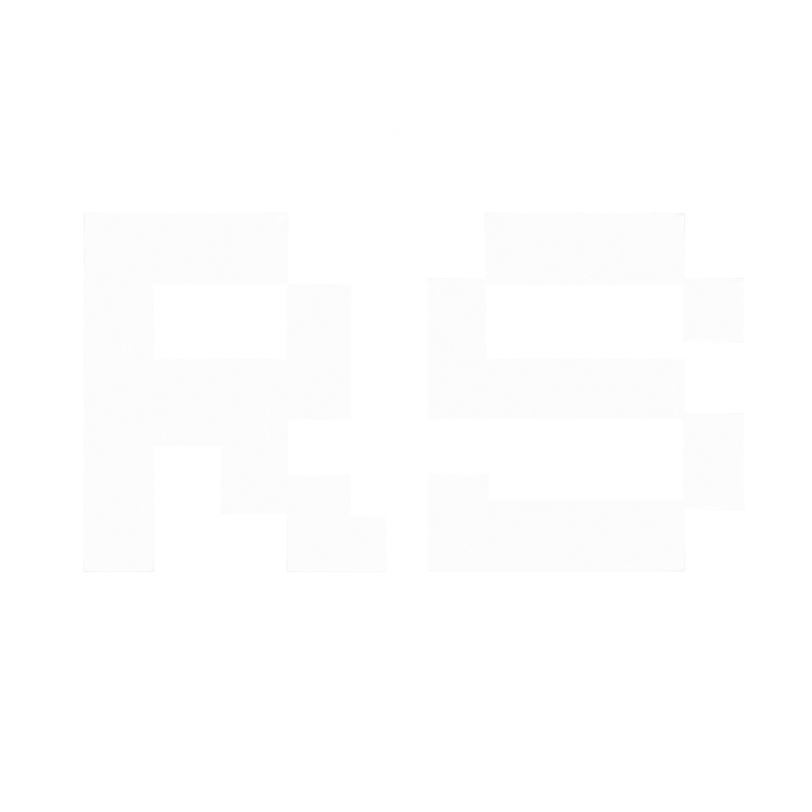
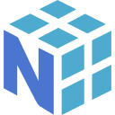
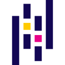
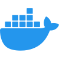
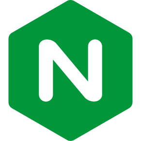
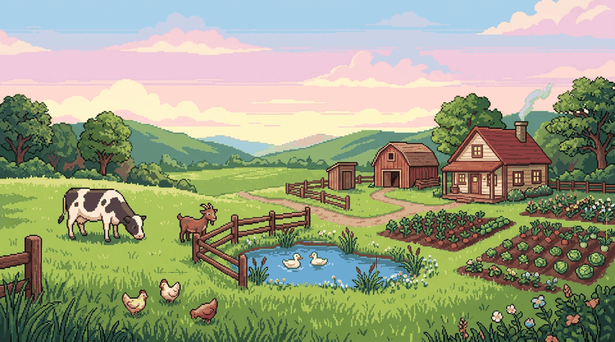

<h1>Hi there , I’m <a href="https://portfolio.rithish.site/" title="Visit my personal portfolio 🌐" style="text-decoration:none; color:#4F46E5;">Rithish S</a></h1>

  

### Connect with me
<a href="https://portfolio.rithish.site/" title="Personal Portfolio: portfolio.rithish.site"><picture></picture></a>&nbsp;&nbsp;
<a href="https://www.linkedin.com/in/rithish-saravanan-32a39431a/" title="LinkedIn: rithish-saravanan"><picture></picture></a>&nbsp;&nbsp;
<a href="https://github.com/rithishcodespace/" title="GitHub: rithishcodespace"><picture><source media="(prefers-color-scheme: dark)" srcset="./public/social-media/github-dark.svg"><source media="(prefers-color-scheme: light)" srcset="./public/social-media/github-light.svg"></picture></a>&nbsp;&nbsp;
<a href="https://leetcode.com/u/rithishcodespace/" title="LeetCode: rithishcodespace"><picture><source media="(prefers-color-scheme: dark)" srcset="./public/social-media/leetcode-dark.svg"><source media="(prefers-color-scheme: light)" srcset="./public/social-media/leetcode-light.svg"></picture></a>&nbsp;&nbsp;
<a href="mailto:rithishcodespace@gmail.com" title="Email: rithishcodespace@gmail.com"><picture></picture></a>&nbsp;&nbsp;
<a href="https://wa.me/919952252304" title="WhatsApp"><picture></picture></a>&nbsp;&nbsp;

## About Me

  

  &nbsp;
  &nbsp;
  &nbsp;
  

<table width="100%">
  <tr>
    <td width="50%" valign="top">
      <h4>🏗️ Architecture &amp; Distributed Systems</h4>
      <ul>
        <li>Architecting <b>high-throughput backend services</b>, event-driven pipelines, and distributed microservices.</li>
        <li>Specialized in <b>Redis BullMQ</b> for asynchronous job orchestration, worker concurrency, and rate limiting.</li>
        <li>Designing for <b>fault tolerance</b>, graceful degradation, circuit breakers, and idempotent processing.</li>
        <li>Polyglot data layer across relational (<b>PostgreSQL, MySQL, SQLite</b>) and NoSQL/In-Memory (<b>MongoDB, Redis</b>).</li>
      </ul>
      <code>Distributed Systems</code> &bull; <code>BullMQ</code> &bull; <code>Fastify</code> &bull; <code>Microservices</code>
    </td>
    <td width="50%" valign="top">
      <h4>🧠 Agentic AI, RAG &amp; MCP</h4>
      <ul>
        <li>Building production-grade agentic workflows with Anthropic's <b>Model Context Protocol (MCP)</b>.</li>
        <li>Engineering semantic retrieval pipelines using <b>RAG, Pinecone, ChromaDB</b>, and local <b>Ollama (Qwen 2.5)</b>.</li>
        <li>Developing autonomous agents with dynamic tool execution, memory persistence, and context compaction.</li>
        <li>Author of <b>DocuRAG</b>, <b>PatentIQ</b>, and <b>MCP_bot</b> production AI architectures.</li>
      </ul>
      <code>MCP</code> &bull; <code>RAG</code> &bull; <code>Pinecone</code> &bull; <code>Ollama</code> &bull; <code>LangChain</code>
    </td>
  </tr>
  <tr>
    <td width="50%" valign="top">
      <h4>⚡ Open Source &amp; Compilers</h4>
      <ul>
        <li><b>ESLint Core Contributor:</b> Merged <a href="https://github.com/eslint/eslint/pull/21218"><b>PR #21218</b></a> resolving IEEE 754 precision underflow edge cases in numeric literal lint rules.</li>
        <li><b>AST Traversal:</b> Deep understanding of JavaScript/TypeScript Abstract Syntax Trees, visitor patterns, and static verification.</li>
        <li><b>Code Health:</b> Actively maintaining open-source CLI tools, backup utilities, and developer productivity libraries.</li>
      </ul>
      <code>ESLint Core</code> &bull; <code>AST Traversal</code> &bull; <code>Static Analysis</code> &bull; <code>Compilers</code>
    </td>
    <td width="50%" valign="top">
      <h4>🏆 Competitive Programming &amp; DSA</h4>
      <ul>
        <li><b>1200+ Problems Solved:</b> Consistent problem solver across <b>LeetCode, CodeChef, and GeeksforGeeks</b>.</li>
        <li><b>Global Rank Top 1.5%:</b> Global Rank <b>#18516</b> on LeetCode with 300+ days active daily streak.</li>
        <li><b>Algorithmic Depth:</b> Author of comprehensive <a href="https://github.com/rithishcodespace/DSA-JAVA"><b>DSA-JAVA</b></a> repository covering advanced Graph theory, Dynamic Programming, and Tries.</li>
      </ul>
      <code>LeetCode Top 1.5%</code> &bull; <code>1200+ Solved</code> &bull; <code>Dynamic Programming</code> &bull; <code>Java</code>
    </td>
  </tr>
  <tr>
    <td width="50%" valign="top">
      <h4>🥇 Hackathons &amp; Competitions</h4>
      <ul>
        <li><b>🏆 4x Hackathon Winner:</b> Champion across multiple high-stakes regional and national hackathons.</li>
        <li><b>🥇 1st Place – IEEE DevSpark Hackathon:</b> Built <b><a href="https://github.com/The-Plantera/Plantera-Web">Plantera AI</a></b>, an environmental intelligence platform analyzing satellite imagery for deforestation detection.</li>
        <li><b>🥇 1st Place – BIT Hackathon:</b> Designed and deployed end-to-end full-stack AI automation architectures in under 36 hours.</li>
        <li><b>🥇 1st Place – Code-Circle Hackathon:</b> Built and shipped high-performance software solutions under rapid turnaround.</li>
        <li><b>🥈 Runner-Up – SNS Ideathon:</b> Recognized for outstanding technical product ideation, feasibility, and system architecture.</li>
      </ul>
      <code>4x Champion</code> &bull; <code>IEEE DevSpark</code> &bull; <code>BIT Hackathon</code> &bull; <code>Code-Circle</code> &bull; <code>SNS Ideathon</code>
    </td>
    <td width="50%" valign="top">
      <h4>☸️ Cloud Native, DevOps &amp; Observability</h4>
      <ul>
        <li><b>Container Orchestration:</b> Multi-container deployments using <b>Docker, Kubernetes</b>, custom ingress, and Nginx reverse proxies.</li>
        <li><b>Cluster Observability:</b> Production monitoring stack with <b>Prometheus</b> metric scrapers, <b>Grafana</b> dashboards, and automated alerting.</li>
        <li><b>Automated CI/CD:</b> Architected GitOps pipelines with dynamic test matrices and automated multi-architecture Docker image builds.</li>
        <li><b>Infrastructure Reliability:</b> Designing self-healing systems, zero-downtime rolling updates, and health probes.</li>
      </ul>
      <code>Kubernetes</code> &bull; <code>Docker</code> &bull; <code>Prometheus</code> &bull; <code>Grafana</code> &bull; <code>GitOps</code>
    </td>
  </tr>
  <tr>
    <td width="50%" valign="top">
      <h4>🌱 Currently Exploring &amp; Researching</h4>
      <ul>
        <li><b>Multi-Agent Swarms:</b> Investigating agent-to-agent consensus loops, tool mediation, and self-correcting task graphs.</li>
        <li><b>High-Performance Systems:</b> Benchmarking <b>Bun</b> runtimes and exploring systems programming in <b>Rust</b> for microsecond latency.</li>
        <li><b>Vector Search Optimization:</b> Experimenting with HNSW vs IVFPQ vector index optimizations and contextual rerankers.</li>
      </ul>
      <code>Multi-Agent Swarms</code> &bull; <code>Bun / Rust</code> &bull; <code>Vector Quantization</code> &bull; <code>HNSW</code>
    </td>
    <td width="50%" valign="top">
      <h4>🤝 Collaboration &amp; Let's Connect</h4>
      <ul>
        <li><b>Open For:</b> High-impact Software Engineering roles, Backend &amp; AI systems discussions, and Open Source contributions.</li>
        <li><b>Ask Me About:</b> Distributed architectures, RAG pipelines, Redis BullMQ, AST analysis, and DSA problem-solving.</li>
        <li><b>Direct Reach:</b> Drop a message at <a href="mailto:rithishcodespace@gmail.com"><b>rithishcodespace@gmail.com</b></a> or on <a href="https://www.linkedin.com/in/rithish-saravanan-32a39431a/"><b>LinkedIn</b></a>.</li>
      </ul>
      <code>Open to Collabs</code> &bull; <code>Engineering Roles</code> &bull; <code>Tech Exchanges</code>
    </td>
  </tr>
</table>

 

## Languages and Tools:
<a href="https://github.com/rithishcodespace"><picture><source media="(prefers-color-scheme: dark)" srcset="https://github-readme-stats-eight-theta.vercel.app/api?username=rithishcodespace&show_icons=true&hide_border=true&theme=dark&include_all_commits=true&count_private=true&line_height=38"><source media="(prefers-color-scheme: light)" srcset="https://github-readme-stats-eight-theta.vercel.app/api?username=rithishcodespace&show_icons=true&hide_border=true&theme=default&include_all_commits=true&count_private=true&line_height=38"></picture></a>

<picture></picture>
<picture></picture>
<picture></picture>
<picture></picture>
<picture></picture>
<picture></picture>
<picture></picture>
<picture></picture>
<picture></picture>
<picture><source media="(prefers-color-scheme: dark)" srcset="./public/languages-and-tools/pandas-dark.svg"><source media="(prefers-color-scheme: light)" srcset="./public/languages-and-tools/pandas-light.svg"></picture>
<picture></picture>
<picture></picture>
<picture></picture>
<picture></picture>
<picture></picture>
<picture></picture>
<picture></picture>
<picture><source media="(prefers-color-scheme: dark)" srcset="./public/languages-and-tools/nextjs-dark.svg"><source media="(prefers-color-scheme: light)" srcset="./public/languages-and-tools/nextjs-light.svg"></picture>
<picture></picture>
<picture><source media="(prefers-color-scheme: dark)" srcset="./public/languages-and-tools/expressjs-dark.svg"><source media="(prefers-color-scheme: light)" srcset="./public/languages-and-tools/expressjs-light.svg"></picture>
<picture></picture>
<picture></picture>
<picture></picture>
<picture><source media="(prefers-color-scheme: dark)" srcset="./public/languages-and-tools/shadcnui-dark.svg"><source media="(prefers-color-scheme: light)" srcset="./public/languages-and-tools/shadcnui-light.svg"></picture>
<picture></picture>
<picture><source media="(prefers-color-scheme: dark)" srcset="./public/languages-and-tools/postgresql-dark.svg"><source media="(prefers-color-scheme: light)" srcset="./public/languages-and-tools/postgresql-light.svg"></picture>
<picture></picture>
<picture></picture>
<picture></picture>
<picture></picture>
<picture></picture>
<picture></picture>
<picture></picture>
<picture><source media="(prefers-color-scheme: dark)" srcset="./public/languages-and-tools/github-dark.svg"><source media="(prefers-color-scheme: light)" srcset="./public/languages-and-tools/github-light.svg"></picture>
<picture></picture>
<picture></picture>
<picture></picture>
<picture></picture>
<picture><source media="(prefers-color-scheme: dark)" srcset="./public/languages-and-tools/linux-dark.svg"><source media="(prefers-color-scheme: light)" srcset="./public/languages-and-tools/linux-light.svg"></picture>
<picture><source media="(prefers-color-scheme: dark)" srcset="./public/languages-and-tools/bash-dark.svg"><source media="(prefers-color-scheme: light)" srcset="./public/languages-and-tools/bash-light.svg"></picture>
<picture></picture>
<picture><source media="(prefers-color-scheme: dark)" srcset="./public/languages-and-tools/aws-dark.svg"><source media="(prefers-color-scheme: light)" srcset="./public/languages-and-tools/aws-light.svg"></picture>
<picture></picture>
<picture><source media="(prefers-color-scheme: dark)" srcset="./public/languages-and-tools/vercel-dark.svg"><source media="(prefers-color-scheme: light)" srcset="./public/languages-and-tools/vercel-light.svg"></picture>

 

  <a href="https://github.com/rithishcodespace">
    <picture>
      <source media="(prefers-color-scheme: dark)" srcset="https://streak-stats.demolab.com/?user=rithishcodespace&theme=dark&hide_border=true&border_radius=4.5">
      <source media="(prefers-color-scheme: light)" srcset="https://streak-stats.demolab.com/?user=rithishcodespace&theme=default&hide_border=true&border_radius=4.5">
      
    </picture>
  </a>

## 👨‍💻 LeetCode Stats

  <a href="https://leetcode.com/u/rithishcodespace/">
    <picture>
      <source media="(prefers-color-scheme: dark)" srcset="https://leetcard.jacoblin.cool/rithishcodespace?theme=dark&ext=heatmap">
      <source media="(prefers-color-scheme: light)" srcset="https://leetcard.jacoblin.cool/rithishcodespace?theme=light&ext=heatmap">
      
    </picture>
  </a>

  &nbsp;
  &nbsp;
  

## Featured Repositories & Projects
- 🤖 **[DocuRAG](https://github.com/rithishcodespace/DocuRAG)** `Python` `RAG` `Vector Embeddings` `LLM`
  > Document-based RAG system extracting and processing PDF documents, persisting vector embeddings locally, and enabling contextual LLM question-answering.
- ⚡ **[PatentIQ](https://github.com/rithishcodespace/PatentIQ)** `TypeScript` `Fastify` `Pinecone` `Ollama (Qwen2.5)`
  > Automated patent prior-art search engine using semantic vector search with Pinecone and local LLM embeddings for technical novelty and claims analysis.
- 🧬 **[RAGForge](https://github.com/rithishcodespace/RAGForge)** `Python` `ChromaDB` `LangChain` `RAG`
  > Modular Retrieval-Augmented Generation pipeline using recursive text chunking, ChromaDB vector storage, similarity search, and contextual generation.
- 🔌 **[MCP_bot](https://github.com/rithishcodespace/MCP_bot)** `Model Context Protocol` `Agentic AI` `Tools API`
  > Autonomous assistant leveraging Anthropic's Model Context Protocol (MCP) to bridge LLMs with external tools, APIs, and file systems.
- 💾 **[db-backup-cli](https://github.com/rithishcodespace/db-backup-cli)** `TypeScript` `Node.js` `Redis BullMQ` `AWS S3` `Docker`
  > Cross-platform database backup orchestration CLI for PostgreSQL, MySQL, MongoDB, and SQLite with distributed job queues and AES-256 encryption.
- ☸️ **[microservices-ci-cd-orchestrator](https://github.com/rithishcodespace/microservices-ci-cd-orchestrator)** `GitHub Actions` `GitOps` `Docker` `Kubernetes`
  > End-to-end CI/CD orchestration system for microservices using GitHub Actions with dynamic test filtering, multi-language pipelines, and GitOps deployments.
- 📊 **[node-monitoring-k8s](https://github.com/rithishcodespace/node-monitoring-k8s)** `Kubernetes` `Prometheus` `Grafana`
  > Kubernetes microservice observability stack with Prometheus and Grafana for cluster metrics collection, alerting, and health visualization.
- 🌿 **[Plantera](https://github.com/The-Plantera/Plantera-Web)** `React` `Node.js` `Python ML` `Mapbox` *(1st Place IEEE DevSpark Hackathon)*
  > AI-powered environmental monitoring and deforestation detection platform using satellite imagery and machine learning.
- 🛠️ **[eslint](https://github.com/rithishcodespace/eslint)** `JavaScript` `AST` `Static Analysis` *(Merged Core PR #21218)*
  > Core open-source contribution to ESLint fixing IEEE 754 precision edge cases for numeric literals under binary64 floating-point underflow.
- 🌐 **[portfolio](https://github.com/rithishcodespace/portfolio)** `React` `Tailwind CSS` `Vite` `Live`
  > Personal interactive developer portfolio ([Live at portfolio.rithish.site](https://portfolio.rithish.site/)) showcasing projects, architecture, and skills.
- 🏆 **[DSA-JAVA](https://github.com/rithishcodespace/DSA-JAVA)** `Java` `Algorithms` `Data Structures`
  > Comprehensive Java solutions for 1200+ algorithm and data structure problems across LeetCode, CodeChef, and GeeksforGeeks.
- 🤝 **[DevTinder](https://github.com/rithishcodespace/DevTinder)** `React` `Node.js` `Express` `MongoDB` `JWT`
  > Full-stack developer networking platform featuring secure JWT authentication, user matching, and connection requests.

## Outside the Code

> *"When the screens go dark, I trade syntax trees for fertile soil and wandering chickens. There is something deeply grounding about working with animals who know nothing of deadlines, getting my hands deep in the earth, and listening to the only operating system that never crashes: nature.*  
>  
> *Tech keeps my mind restless, curious, and always building. But the farm is where I slow down, breathe, and remember the world doesn't always need to be optimized."*

  

